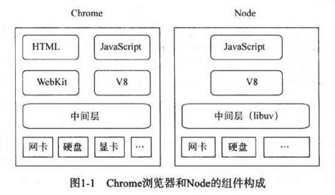

## 1 node与chrome
我们知道在chrome浏览器中，使用v8引擎作为javascript的解析引擎，同时还有一个webkit布局引擎用于解析css、html以及计算网页布局。node的结构和chrome浏览器十分相似，也是使用v8引擎作为javascript的解析引擎，它们两者都是基于事件驱动的异步架构，不同的是浏览器是通过事件驱动来服务页面交互，而node通过事件驱动来服务I/O。


## 2 node的特点
### 2.1 异步I/O
与前端发起一次ajax请求一样，node中的I/O操作都是异步的，例如读取文件操作：
```javascript
let fs = require('fs');

fs.readFile('/path', function(err, file) {
    console.log('正在读取文件');
})
console.log('读取文件完成');
```
以上代码在控制台上会先打印出"读取文件完成"，再打印"读取文件完成"，这是因为node中文件操作是异步的，这样是异步机制的好处在于进行I/O操作时不会阻塞代码的执行，从而极大的提高了运行效率。

### 2.2 事件与回调
在异步机制中当异步操作完成时，该如何返回数据呢？ 在node中是通过回调函数和事件监听的方式返回数据的，例如使用node创建一个web服务器：
```javascript
let http = require('http');

http.createServer(function(req, res) {
    req.setEncoding('utf-8');

    // 监听请求的data事件
    req.on('data', function() {
        // do something
    })

    // 监听请求的end事件
    req.on('end', function() {
        // do something
    }).listhen(3000);
})
```
上面代码创建了一个简易的web服务器，为请求的data事件和end事件分别设置了相应的回调函数，当服务器监听到此类事件时就会触发执行相应的回调函数。

### 3 单线程
javascript是单线程语言，因此node也不例外，保持了其单线程的特点。单线程最大的好处在于不用像多线程编程那样处处考虑状态同步的问题，node中没有死锁的存在，也不存在线程上下文交换所带来的的性能开销。但是单线程也有自身的弱点，主要存在以下几个方面：
+ 无法利用多核CPU
+ 错误会导致整个应用的退出，应用的健壮性值得考验
+ 大量的计算占用CPU导致无法继续调用异步I/O
为了解决无法利用多核CPU的问题和单线程健壮性的问题，node采用了创建子进程的的方式。通过创建子进程将大量的计算分解掉，在通过进程之间的事件消息来传递结果
```javascript
const { spawn } = require('child_process');
const ls = spawn('ls', ['-lh', '/usr']);

ls.stdout.on('data', (data) => {
  console.log(`输出：${data}`);
});

ls.stderr.on('data', (data) => {
  console.log(`错误：${data}`);
});

ls.on('close', (code) => {
  console.log(`子进程退出码：${code}`);
});
```
上面代码通过创建子进程来执行ls命令（列出user目录下的所有文件），在通过监听子进程的data事件和close事件执行相应的回调函数，node多进程编程见[第九章：玩转进程](../第九章：玩转进程/README.md)

## 4 node的应用场景
node是一门轻量级的后台语言，在某些应用场景性能十分突出，关于node，我们探讨的较多的主要是I/O密集型和CPU密集型。

### 4.1 I/O密集型
由于node是一门单线程语言，从单线程的角度来说，node的I/O处理能力十分优秀，对于I/O密集型应用，node的优势在于利用了事件循环的处理能力，而不是每一个请求都启动单独的线程来处理，其资源占用极少。

### 4.2 CPU密集型
对于CPU密集型应用，node虽然没有提供多线程支持用于CPU计算，但是node还是提供了以下两种方式来充分利用CPU：
+ 编写C/C++扩展模块，通过编写C/C++扩展的方式来实现一些v8不能做到的性能机制的任务
+ 如果单线程的node不能满足需求，甚至使用C/C++还不够的，那么可以通过子进程的方式，将一部分node进程当做常驻服务进程用于CPU计算，然后利用进程进程的消息来传递计算结果，将计算与I/O分离，这样还能充分利用CPU。

### 4.3 分布式应用
阿里巴巴数据平台对node的分布式应用算是一个典型的例子，数据平台通常需要在一个数据库集群中去寻找需要的数据，阿里巴巴开发了中间层应用nodeFox、ITier，将数据库集群做了划分和映射，每次查询数据依旧是是针对单张表进行SQL查询，中间层会分解查询SQL，并行的从多台数据库中个获取数据并合并。
