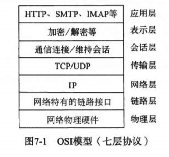
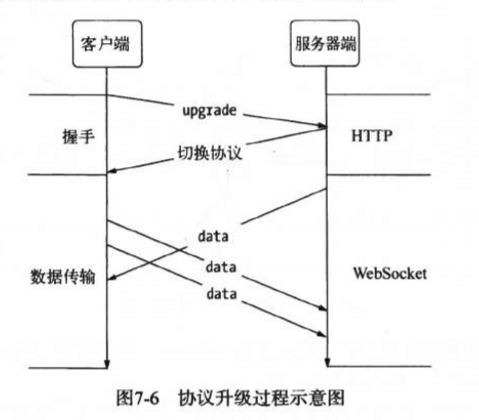
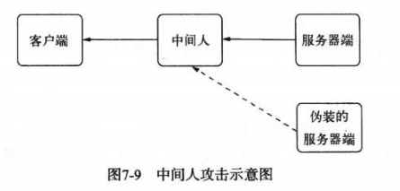

## 1 构建TCP服务
node是一个面向网络而生的平台。它具有事件驱动、无阻塞、单线程等特性，具备良好的可伸缩性，适合在分布式网络中扮演各种角色。同时利用node可以十分方便的搭建网络服务器，提供了net、dgram、http、https这4个模块，分别用来处理TCP、UDP、HTTP、HTTPS。

### 1.1 TCP
TCP全名为传输协议，在OSI模型中属于传输层协议，许多应用层协议都是基于TCP协议构建，典型的是HTTP、SMTP、IMAP等协议。

TCP是面向连接的协议，其显著特征是在传输之前需要3次握手形成会话，这里不再赘述，对此不熟悉的执行阅读计算机网络相关书籍。

### 1.2 创建TCP服务端
我们通过下面代码来创建一个TCP服务器来接受网络请求：
```javascript
const net = require('net');

let server = net.createServer(function(socket) {
	// 新的连接
	socket.on('data', function(data) {
		socket.write('你好');
	});

	socket.on('end', function() {
		console.log('连接断开');
	});

	socket.write('欢迎光临《深入浅出node.js》');
})

server.listen(3000, function() {
	console.log('正在监听3000端口');
});
```
运行上面代码之后，我们可以通过telnet工具作为客户端对刚才创建的简单服务器进行会话交流。

### 1.3 TCP服务的事件
TCP服务事件可以分为两类事件：服务器事件和连接事件
#### 服务器事件
对于通过net.createServer()创建的服务器而言，它有以下几种事件：
+ listening：通过调用server.listen()绑定端口后触发
+ connection：每个客户端套接字连接到服务器时触发
+ close： 服务器关闭时触发
+ error：服务器发生异常时触发

#### 连接事件
服务器可以同时与多个客户端保持连接，对于每个连接而言是典型的可写可读Stream对象。每个Stream对象可用于服务器到客户端之间的通信，它具有以下事件：
+ data：当一端调用write()发送数据时，另一端会触发data事件。
+ end：当连接中的任意一端发送了FIN数据时，会触发该事件。
+ connect：该事假作用域客户端，当套接字与服务器端连接成功是会触发。
+ drain：当任意一端调用write()发送数据时，当前这端将会触发该事件。
+ error：当异常发生时，触发该事件。
+ close：当套接字完全关闭时，触发该事件。
+ timeout：当一定时间后连接不再活跃是，该事件被触发，通知用户当前连接已经被闲置。
值得注意的是，TCP针对网络中的小数据包有一定的优化策略：Nagle算法。Nagle算法针对小数据包，要求缓冲区的数据达到一定的数量或者一定时间后才能将其发送，所以多个小数据包可能会被Nagle算法合并成一个大数据包，以此来优化网络。
早node中默认启动了Nagle算法，不过也可以调用socket.setNoDelay(true)来去掉Nagle算法，使write()可以立即发送数据到网络中。

## 2 构建UDP服务
UDP服务又称为用户数据报协议，与TCP一样属于传输层协议，UDP与TCP最大的不同是UDP不是面向连接的，而是无连接的协议。在UDP中，一个套接字可以与说个UDP服务通信，它虽然提供面向事务的简单不可靠传输服务，在网络差的情况下存在丢包的严重问题。但是由于它是无连接的，资源消耗低，处理快速且灵活，所以常用于即使偶尔丢一两个数据包也不会产生重大影响的场景，比如音频、视频等。UDP目前应用广泛，DNS服务就是基于它实现的。

### 2.1 UDP套接字事件
UDP套接字相对于TCP套接字使用起来更加的简单，它只是一个EventEmitter的实例，而非Stream的实例，它具有以下事件：
+ message：当UDP套接字侦听网卡端口后，接收到消息时触发该事件。
+ listening：当UDP套接字开始侦听时触发该事件。
+ close：当调用close()方法时触发该事件，并不触发message事件。
+ error：当异常发生时触发该事件，如果不侦听，异常将直接抛出，导致进程退出。

## 3 构建HTTP服务
TCP和UDP都属于传输层协议，如果要构造高效的网络应用，就应该从传输层进行着手。但是对于经典的应用场景，则无需从传输层协议入手构造自己的应用，比如HTTP、SMTP等，这些经典的应用层协议对于普通的应用绰绰有余。node也提供了基本的http模块和https模块用于构建HTTP服务和HTTPS服务。

### 3.1 初始HTTP
HTTP全称是超文本传输协议，HTTP洗衣构建在TCP协议之上，属于应用层协议，在HTTP的两端分别是服务器和浏览器，即著名的B/S模式

### 3.2 HTTP报文
HTTP报文可以分为请求报文和相应报文，不管是请求报文还是响应报文，报文内容都都包含两个部分：报文头和报文体。由于此处涉及的知识更多的是关于计算机网络的，这里同样也不做详细的介绍，对于HTTP报文不熟悉的可以自行阅读计算机网络相关书籍。
对于一次浏览器端发起的网络请求，其过程大致是：首先，浏览器构造HTTP报文发现服务器端，然后服务器端判断报文中的请求地址，将浏览器请求的数据按照请求报文的格式发送给浏览器，浏览器接收到相应报文后，调用渲染引擎将其显示给用户。


### 3.3 http模块
node的http模块包含对HTTP处理的封装，在node中HTTP服务继承自TCP服务器（net模块），它能够与多个客户端保持连接，由于其采用的事件驱动的形式，并不用为每一个连接创建额外的线程或进程，保持很低的内存占用，所以能实现高并发。
HTTP服务于TCP服务的区别在于，在开启keepalive后，一个TCP会话可以用于多次请求和相应，TCP服务是以connection为单位进行服务的，HTTP服务是以request为单位进行服务的。

#### HTTP服务的事件
HTTP服务器也是一个EventEmitter实例，它具有以下自定义事件：
+ connection事件：在开始HTTP请求和响应前，客户端和服务器需要建立底层的TCP连接，当这个连接建立时，服务器触发一次connection事件。
+ request事件：建立TCP连接后，http模块底层将数据流中抽象出HTTP请求和HTTP响应，当请求数据发送到服务器端，在解析出HTTP请求头之后，将会触发该事件。
+ close事件：调用server.close()方法停止接受新的连接，当已有的链接都断开时，触发该事件。注意需要等到已有的连接全部断开时才会触发该事件。
+ checkContinue事件：某些客户端在发送较大的数据时，并不会将数据直接发送，而是先发送一个头部带<code>Expect: 100-continue<code>的请求到服务器，服务器将会触发checkContinue事件，如果没有为服务器监听这个事件，服务器将会自动响应<code>100 Continue</code>的状态码表示接受数据继续上传。如果不接受数据时，响应客户端<code>400 Bad Request</code>拒绝继续发送数据。需要注意的是，当该事件发生时不会触发request事件，而是当客户端收到<code>100 Continue</code>响应后重新发起请求时，才会触发request事件。
+ connect事件：当客户端发起CONNECT请求时触发，而发起CONNECT请求通常在HTTP代理时出现，如果不监听该事件，发起该请求的连接将会关闭。
+ upgrade事件：当客户端要求升级连接协议时，需要与服务器端协商，客户端会在请求头中带有Upgrade字段，服务器端接收到这样的请求时，会触发该事件。
+ clientError事件：连接的客户端触发error事件时，这个错误会传递到服务器端，此时触发该事件。

## 4 构建WebSocket服务
提到node，不得不说WebSocket协议，它与node之间的配合堪称完美，其理由有两条：
+ WebSocket客户端基于事件的编程模型与node中的自定义事件相差无几。
+ WebSocket实现了客户端与服务器之间的长连接，而node事件驱动的方式十分擅长与大量的客户端保持并发连接。
除此之外WebSocket相对于HTTP还有如下好处：
+ 客户端与服务器端只建立一个TCP连接，可以使用更少的连接。
+ WebSocket服务器可以推送数据到客户端，这远比HTTP请求响应模型更加灵活、高效。
+ 有更加轻量的协议头，减少数据的传送量。
下面我们用一段代码展示WebSocket在客户端的应用：
```javascript
const socket = new WebSocket('ws://127.0.0.1:12010/updates');
socket.onopen = function() {
	setInterval(function() {
		if(socket.bufferedAmount === 0) {
			socket.sent(getUpdateData());
		}
	}, 50)
};

socket.onmessage = function() {
	// do something
}
```
上述代码中，服务器和客户端创建WebSocket协议请求，在完成请求后连接打开，每50毫秒与服务器端发送一次数据，同时通过onmessage()方法接收服务器端传过来的数据。
相比于HTTP，WebSocket更加接近传输层协议，它并没有在HTTP的基础上模拟服务器端推送，而是在TCP上定义独立的协议，但是WebSocket的握手部分却是有HTTP完成的。

### 4.1 WebSocket握手
在客户端建立连接时，通过HTTP发起请求报文，如下所示：
```javascript
GET /chat HTTP/1.1
Host: server.example.com
Upgrade: webSocket
Connection: Upgrade
sec-WebSocket-key: dGhlIHNhbXBsZSBub25jZQ
sec-WebSocket-protocol: chat, superchat
sec-WebSocket-Version: 13
```
与普通的HTTP协议略有区别的在于如下这些协议头：
```javascript
Upgrade: webSocket
Connection: Upgrade
```
上述两个字段表示请求服务器端升级协议为webSocket，其中sec-WebSocket-key用于安全校验。服务器端收到之后将其与字符串258EAFA5-E914-47DA-C5AB0DCB5B11相连，形成新的字符串，然后通过sha1安全散列算法计算结果后，再进行Base64编码，最后返回给客户端。

### 4.2 WebSocket数据传输
在握手完成后，当前连接将不再进行HTTP的交互，而是开始WebSocket的数据帧协议，实现客户端与服务器的数据交换。

握手完成后客户端的onopen()将会被触发执行，而服务器端则没有此方法，当然也就不会触发。
当客户端调用send()发送数据时，服务器端触发onmessage()，当服务器端调用send()发送数据时，客户端的onmessage()触发。当我们调用send()发送一条数据时，协议可能将这个数据封装为一帧或多帧数据，然后逐帧发送。

### 4.3 WebSocket数据帧格式
关于WebSocket数据帧的格式，这里不做详细的讲解，想要了解更多、更详细的知识，请自行查看相关知识。

## 5 网络服务与安全
我们知道在HTTP协议中，数据在网络中传输传输时是透明的，为了确保数据传输的安全性，之后提出了SSL安全协议，它在传输层提供了对网络连接加密的功能，对于应用层而言，它是透明的，数据传递到应用层之前就完成了加密和解密的过程。
最初的SSL应用在web上，被服务器端和浏览器端同时支持，对吼IETF将其标准化，称为TLS。
node在网络安全上提供了3个模块，分别是crypto、tls、https。其中crypto主要用于数据加密和解密功能，sha1、md5等加密算法都体现在其中。这里我们重点注意的是tls模块和https模块。
tls模块提供了与net模块类似的功能，区别在于它建立在TLS/SSL加密的TCP连接上，对于https而言，它完全与http模块接口一致，区别也进在于它建立于安全连接上。

### 5.1 TLS/SSL
#### 5.1.1 秘钥
TLS/SSL是一个公钥/私钥的结构，它是一个非对称结构，每个服务器和客户端都有自己的公钥。公钥用来加密要传输的数据，私钥用来解密接收到的数据。公钥和私钥是配对使用的，通过公钥加密的数据，只有通过私钥才能进行解密，所以在建立安全连接传输之前没客户端和服务器之间需要互换公钥。
node在底层采用的是openssl实现TSL/SSL的，为此要生成公钥和私钥可以通过openssl完成，我们分别为服务器和客户端生成私钥：
``javascript
// 生成服务器端私钥
$ openssl genrsa -out server.key 1024

// 生成客户端私钥
$ openssl genrsa -out client.key 1024
```
上述命令生成了两个1024位长的RSA私钥文件，我们可以通过它继续生成私钥：
``javascript
openssl rsa -in server.key -pubout -out server.pem
openssl rsa -in client.key -pubout -out client.pem
```
公私钥的非对称加密虽好，但是在网络中依然可能存在窃听的情况，典型的就是中间人攻击。客户端和服务端在交换公钥的过程中，中间人对客户端扮演服务器的角色，对服务器扮演客户端的角色，因此客户端和服务器几乎感受不到中间人的存在，
为了解决这种安全问题，数据传输过程中还需要对得到的公钥进行认证，以确认得到的公钥是出自目标服务器。如果不能保证这种认证，中间人可能会将伪造的站点响应给用户，从而造成安全问题。下图为中间人攻击的示意图

为了解决这个问题，TLS/SSL引入了数字证书来进行认证。与直接用公钥私钥不同，数字证书中包含了服务器的名称和主机名、服务器的公钥、签名颁发机构的名称、来自签名颁发机构的签名。在建立连接前，会通过证书中的签名确认收到的公钥是来自目标服务器，从而产生信任关系。

#### 5.1.2 数字证书
为了确保我们的数据安全，现在我们引入了一个第三方：CA（数字证书认证中心）。CA机构的作用是为站点颁发证书，且这个证书中具有CA通过自己的公钥和私钥实现的签名。
为了得到签名证书，服务器端需要通过自己的私钥生成CSR（证书签名请求）文件。CA机构将通过这个文件颁发属于该服务器端的签名证书，只有通过CA机构就能验证证书是否合法。

### 6 HTTPS服务
HTTPS服务就是工作在TLS/SSL上的HTTP，在了解到TLS服务后，创建HTTPS服务就很容易了。其创建步骤如下：
+ 准备证书
+ 创建HTTPS服务
+ HTTPS客户端
这里不做详细介绍，具体操作自行百度。
