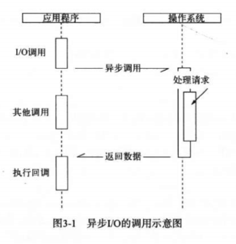
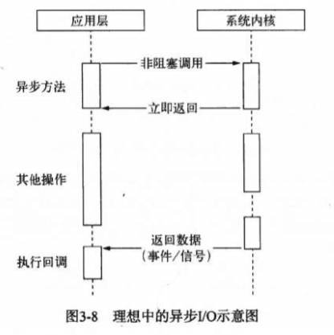
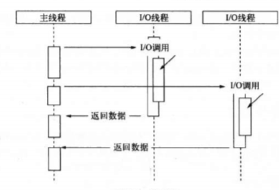
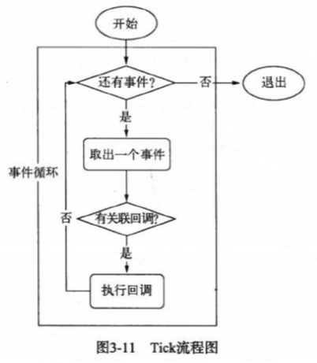
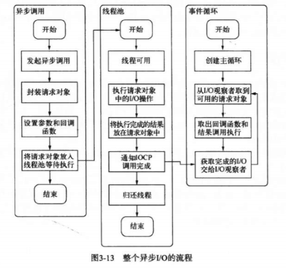
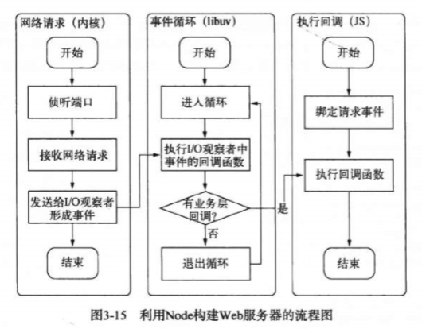

## 1 异步I/O的意义
### 1.1 资源分配
我们假设一个场景，目前有一组互不相关的任务需要我们进行处理，按现行主流的处理方法有两种：
+ 单线程串行依次执行
+ 多线程并行完成
这两种方式各有优缺点，单线程串行执行的优点在于简单，没有创建线程和执行期线程上下文切换的开销，缺点在于CPU利用率低，I/O操作会阻塞后面任务的执行；而多线程并行执行的优点在于所有任务并行执行，能有效提高CPU的利用率，但是常常需要面临锁、状态同步的问题。
node为了解决这个问题，提出了介于两者之间的方案：利用单线程，远离多线程死锁、状态同步等问题，同时利用异步I/O，让单线程远离阻塞，以更好的提高CPU利用率。


## 2 异步I/O实现现状
在了解node中的异步I/O之前，我们先来了解一下操作系统中异步I/O的实现情况。

### 2.1 异步I/O与非阻塞I/O
在node中，我们经常会听到异步、非阻塞、回调、事件这些词语，其中异步和非阻塞听起来似乎是同一回事，但是从计算机内核I/O而言，异步和非阻塞其实是两回事。
操作系统内核对于I/O只有两种方式：阻塞和非阻塞。
其中阻塞I/O的特点就是在调用之后一定要等到系统内核层面完成所有操作之后，调用才结束。以读取磁盘上的文件为例，系统内核在完成磁盘寻道、读取数据、复制数据到内存中之后这个调用才结束。阻塞I/O造成CPU的等待，浪费了大量时间在等待I/O完成上，导致CPU的处理能力不能充分利用。
非阻塞I/O与阻塞I/O不同之处在于调用之后会立即返回，返回之后CPU可以处理其他的事务，此时可以明显提高CPU利用率。但是非阻塞I/O也存在相应的问题，由于完整的I/O并没有完成，所以立即返回并不是业务层期望的数据，而仅仅是当前的调用状态，为了获取完整的数据，应用程序需要不断重复的调用I/O来确认I/O是否完成，这种重复的调用操作技术称为<b>轮询<b>（这里不再介绍轮询的实现），轮询会让CPU重复的处理状态判断，因此也是对CPU资源的浪费。

### 2.2 理想的非阻塞异步I/O
我们期望的完美异步I/O应该是应用程序发起非阻塞调用之后，就可以处理下一个任务，然后在I/O调用结束后通过信号或回调的方式将数据传递给应用程序即可。


在多线程情况下，异步IO是通过线程池来实现的，通过让部分线程进行阻塞IO或者非阻塞IO加轮询技术来获取数据，让另一个线程进行处理计算，通过线程之间的通信将IO得到的数据进行传递，使用这样的方式来实现异步IO（利用线程池的方式来模拟）。

这里需要说一下，对于不同的操作系统，其异步IO的实现是不同的，对于*nix和window之间的差异，node提供了libuv中间层作为封装，在libuv层完成不同平台兼容性的判断，以兼容不同的操作系统。

### 2.3 node的异步IO
对于node而言，虽然node是一门单线程语言，但是这里的单线程仅仅只是javascript执行在单线程中，对于node的异步IO而言，不论是在*nix还是在windows上，其内部的完成IO任务还是通过线程池来完成的。
node中实现整个异步IO的环节主要有事件循环、观察者和请求对象。

#### 2.3.1 事件循环
事件循环是node自身的执行模型，正式由于事件循环使得回调函数变得十分普遍。
在node进程启动时便会创建一个类似于while(true)的循环，每执行一次循环的过程我们称之为Tick，每次Tick的过程就是查看事件队列是否有事件待处理，如果有则取出与之关联的回调函数，如果存在关联的回调函数，就执行他们。


#### 2.3.2 观察者
在每次Tick的过程中，如何判断是否有事件需要处理呢？ 这里就要引入观察者的概念了，每个事件循环中都有一个或多个观察者，判断是否有待处理的事件实际就是向观察者询问是否有待处理的事件。在node中，事件主要来自于网络请求、文件IO等，这些事件对应的观察者也是不同的，网络请求对应网络IO观察者，文件IO对应文件IO观察者，<b>观察者对事件进行了分类</b>。
事件循环是一个典型的生产者/消费者问题，异步IO、网络请求等是事件的生产者，这些事件被传到观察者那里，事件循环则作为消费者从观察者那里取出事件并处理。

#### 2.3.3 请求对象
前面提到过事件循环使得回调函数十分普遍，node中的异步IO通常需要传入一个回调函数以便在事件完成后执行一些操作，传入的这个回调函数是由系统调用，而不是用户调用。那么在发起一个请求到回调函数被调用者中间发生了什么呢？这里涉及到底层的一些东西，只做简单的介绍，不再深入，以异步文件IO为例：
+ 发起一次异步文件IO请求
+ 在javascript调用C++核心模块进行底层操作
+ 创建一个请求对象，将请求的参数（文件路径、回调函数等）封装到请求对象中
+ 将该请求对象放入到线程池中，等待系统调用，然后返回此次IO请求（释放CPU执行其他操作）
+ 通过事件循环，当此次IO请求完成时，再通过回调函数的方式来返回请求结果
请求对象时异步IO过程中的中间产物，所有的请求状态都保存在这个对象中，包括送入线程池等待执行的以及IO操作完成后的回调处理。

## 3 非IO的异步IO
大多数情况下我们提到异步都是异步IO，但是其实node中还存在一些与IO无关的异步API，例如：seTimeout()、setInterval()、setImmediate()和process.nextTick()。

### 3.1定时器
seTimeout()和setInterval()的实现原理与异步IO类似，只是不需要线程池的参与，调用seTimeout()和setInterval()会将创建的定时器插入到定时器观察者内部的一个红黑树中，每次Tick执行时，会从该红黑树中迭代取出定时器对象，检查是否超过定时时间，如果超过则形成一个事件，它的回调函数将立即执行。
seTimeout()和setInterval()存在的问题在于定时器并不是完全精确的，虽然一次Tick的时间非常短，但是如果一次循环占用了较多时间，那么定时器可能会出现微小（可忽略）的误差。例如：通过setTimeout()设定一个任务在10毫秒后执行，但是在9毫秒后，有一个任务占用了5毫秒的CPU时间片，在此轮到定时器执行时已经是第14毫秒了，超过了规定时间4毫秒。

### 3.2 process.nextTick()
有时候我们需要创建一个立即执行的异步任务，我们会怎么做呢？也许可以使用前面提到的setTimeout()来实现:
```javascript
setTimeout(function() {
    // 异步请求
}, 0)
```
这样做的问题有两个：首先是前面提到的setTimeout()定时器并不精确，其次采用定时器的需要动用红黑树，动用红黑树对性能会有一定的影响。实际上我们可以使用process.nexttick()方法来实现：
```javascript
process.nextTick(function() {
    // 异步请求
})
```
与setTimeout()相比，process.Tick()的时间复杂度为O(1)，而setTimeout()的时间复杂度为O(lg(n))。

### 3.3 setImmediate()
setImmediate()方法与process.nextTick()方法十分类似，都是将回调函数延迟执行。两者之间的差别在于优先级的差异，process.nextTick()的优先级要高于setImmediate()，在具体实现上process.nextTick()的回调函数保存在一个数组中，每轮Tick会将数组中的所有回调函数全部执行；而setImmediate()的回调函数保存在一个链表上，每次Tick只会执行一个回调函数。
```javascript
process.nextTick(function() {
	console.log("第一轮第一次process.nextTick")
})

setImmediate(function() {
	console.log("第一轮第一次setImmediate")

	// 第二轮Tick
	process.nextTick(function() {
		console.log("第二轮process.nextTick")
	})
})

setImmediate(function() {
	console.log("第一轮第二次setImmediate")
})
```
上面代码的执行结果依次是"第一轮第一次process.nextTick"、"第一轮第一次setImmediate"、"第二轮process.nextTick"、"第一轮第二次setImmediate"。可以看出"第一轮第二次setImmediate"是在"第二轮process.nextTick"之后执行，所以其实它是在第二轮才执行的，并不是在第一轮Tick执行的。

## 事件驱动与高性能服务区
通过前面的介绍，我们大致了解了基于事件驱动的实质，即通过事件循环加事件触发的方式来运行程序，利用node构建的web服务器正是在这样的基础上实现的。

下面我们再介绍几种经典的web服务器模型，并做一些优缺点对比：
+ 同步式：对于同步式的服务，一次只能处理一个请求，其余请求都处于等待状态
+ 每进程/每请求：为每个请求启动一个进程，这样可以处理多个请求，但是不具备扩展性，有内存限制
+ 每线程/每请求：为每个请求启动一个线程来处理，尽管线程比进程要轻量，但依然会有内存限制
每线程/每请求的典型代表就是Apache服务器，而node基于事件驱动的方式有效的避免了创建线程和销毁线程的开销，即使在大量连接的情况下也不受线程上下文切换开销的影响，这是node高性能的一个原因。
事件驱动的高效已经渐渐被业界所重视，Nginx服务器就是采用了和node相同的事件驱动机制，与node不同的是Nginx采用纯C编写，性能较高，但它只适合做服务器，用户反向代理和负载均衡的服务。