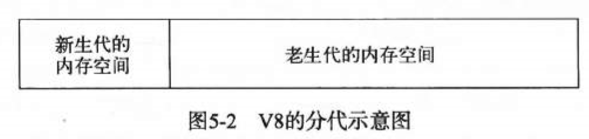
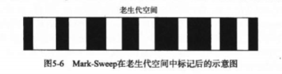
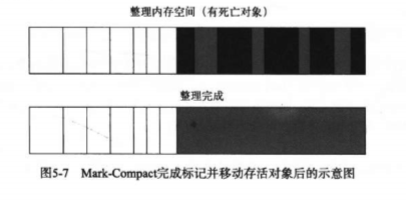

## 1 v8的垃圾回收机制和内存限制
首先我们知道，javascript语言和java一样，由垃圾回收机制自动管理内存，这使得我们不用像C/C++编程那样时刻关注内存中分配与释放问题。在进行浏览器开发时，很少会遇到内存泄漏的问题，但是使用node进行服务器端编程时，我们就不得不考虑内存泄漏的问题。

### 1.1 v8的内存限制
在一般的后端开发语言中，在基本的内存使用上不会有什么限制，但是在node中通过javascript使用内存时就会发现只能只用部分内存，在这样的限制下，将会导致node无法直接操作大内存对象，例如无法将一个2GB的文件读入内存中进行字符串解析，这样在单个node进程的情况下，计算机的内存资源无法得到充分的使用。
造成这个问题的原因在于node是基于v8构建的，所以在node中使用javascript对象基本上都是通过v8自己的方式进行分配和管理的。

### 1.2 v8中的对象分配
在v8中，所有的javascript对象都是通过堆来进行分配的。node提供了v8中内存使用量的查询方式：
```javascript
$ node
> process.memoryUsage();
{ rss: 23044096,
  heapTotal: 7684096,
  heapUsed: 5279824,
  external: 8656 }
```
上面数据中rss是进程常驻内存部分，heapTotal是v8的堆总内存，heapUsed是v8堆已使用内存。我们在代码中声明变量并赋值时，所使用的对象的内存就分配在堆中，如果已申请的堆控线内存不够分配新的对象，将继续申请堆内存（动态分配内存），知道堆的大小超过v8的限制为止。
当然v8引擎对于堆内存的限制也不是不能解除，v8提供了选项让我们使用更多的内存，在node启动时可以传递<code>--max-old-space-size</code>或<code>--max-new-space-size</code>
```javascript
node --max-old-space-size=1700 test.js      // 单位为MB
// 或者
node --max-new-space-size=1024 test.js      // 单位为KB
```

### 1.3 v8的垃圾回收机制
在介绍v8的垃圾回收机制之前，我们先了解一下各种垃圾回收算法。
#### v8主要的垃圾回收算法
v8的来及回收策略主要是基于分代式的垃圾回收机制。在实际的应用中，对象的生存周期长短不一，不同的算法只能针对特定的情况达到最好的效果，没有一种算法可以胜任任何场景。因此现代垃圾回收算法按对象的生存时间将内存的垃圾回收进行不同的分代，然后针对不同分代的内存采用不同的回收算法。
+ v8的内存分代
在v8中主要将内存分为新生代和老生代两种，新生代中对象的存货时间较短，而老生代中对象的生存时间较长或为常驻内存对象。新生代内存要远小于老生代的内存。


+ Scavenge算法
在分代的基础上，新生代中的对象通过Scavenge算法进行垃圾回收，在Scavenge的具体实现中主要采用Cheney算法，该算法的主要思想是一种采用复制的方式实现垃圾回收。它将堆内存一分为二，两个空间一个处于使用状态，另一个处于闲置状态，处于使用状态的的空间称为From空间，而处于闲置状态的空间称为To空间。当我们分配对象时先是在From空间进行分配，当进行垃圾回收时检查From空间中的存活对象，这些存活对象将会被复制到To空间，而非存活对象将会被释放。完成复制后，From空间和To空间的角色对换。
Scavenge算法的缺点是只能使用堆内存的一般，对于生命周期较短的场景存活对象只占少部分，所以它在时间效率上表现优异，这是一种典型的牺牲空间换取时间的做法。因为新生代的对象生命周期都比较短，所以适合使用该算法进行垃圾回收。
新生代的对象也可能晋升到老生代内存中，当一个对象经过多次复制之后依然存活时，我们就认为它是生命周期较长的对象，这样的对象随即会被移动到老生代内存中。这样的过程称之为晋升，另外一个晋升的判断条件是To空间的占用比，当要从From空间复制一个对象到To空间时，如果To空间已经使用超过了25%，则这个对象直接晋升到老生代空间中。

+ Mark-Sweep & Mark-Compact算法
对于老生代中的对象，由于存活对象占较大比重，不再适合Scavenge算法，因此对于老生代中的对象一般采用Mark-Sweep（标记清除）和 Mark-Compact（标记整理）算法。
Mark-Sweep算法将垃圾回收分为了标记和清除两个阶段，在标记阶段遍历堆中的所有对象，并标记活着的对象，在随后的清除阶段只清除死亡的对象（即没有标记的对象），因为死对象在老生代中只占小部分，所以Mark-Sweep算法较为高效。
Mark-Sweep算法存在着一个问题，即进行一次标记清除后，内存空间会出现大量不连续的状态（内存碎片），这种内存碎片会对后续的内存分配造成问题，当出现一个大内存对象需要分配时，这样的内存碎片无法完成分配。

为了解决内存碎片的问题，Mark-Compact算法被提出，Mark-Compact是标记整理的意思，在整理过程中，将或者的对象往一端移动，移动完成后只需要直接清理掉边界外的内存即可。


+ 垃圾回收时的停顿时间
为了避免应用逻辑与垃圾回收其看到不一致的情况，在执行垃圾回收时都需要暂停应用逻辑，待执行完垃圾回收后再恢复执行应用逻辑，这种行为被称之为"全停顿"。对于新生代的垃圾回收，由于其配置较小且存活的对象较少，所以一次全停顿的时间较短，对应用逻辑的执行不会造成影响。但是对于老生代的垃圾回收，由于其配置较大，且存活的对象较多，一次全堆垃圾回收的标记、清除、整理过程造成的停顿时间较长，因此需要使用一种方法降低停顿时间。
为了降低全堆垃圾回收机制带来的停顿时间，v8先从标记阶段入手，将原本要一起停顿完成的动作改为<b>增量标记</b>，也就是拆分为许多小"步近"，每做完一步就让javascript应用逻辑执行一小会儿，让垃圾回收和应用逻辑交替进行知道标记阶段完成。

## 2 高效的使用内存
在v8面前，开发者需要做的是让垃圾回收机制更加高效的工作，而把垃圾回收的工作交个v8引擎完成。
为了编写出高质量的javascript代码，让垃圾回收机制高效的运行，我们必须要了解javascript所具有的一些特性：
+ 作用域：某一变量的有效区域，ES5分为全局作用域和函数作用域，ES6分为全局作用域和局部作用域。
+ 作用域链：由一层一层的作用域嵌套形成的作用域链。
+ 闭包：能够让局部变量不被垃圾回收机制回收的一种编程方法。
以上三个特性均为自己总结，可能存在描述不准确之处，如果对这些特性不了解，建议自行啃食《javascript高级程序设计》。

## 3 内存指标
一般而言，应用中存在一些全局对象时正常的，而且在正常的使用中，变量都会自动释放回收。但是如果出现了一些我们认为会回收但是却没有回收的对象时，就会导致内存张勇无限增长，一旦达到v8内存限制就会导致内存溢出错误，进而导致进程崩溃。

### 3.1 查看内存使用情况
除了前面提到的process.memoryUsage()可以查看内存使用情况，os模块的totalmem()和freemem()方法也可以查看内存使用情况。现在我们来看看内存溢出的情况，首先我们要编写导致内存溢出的代码：
```javascript
const userMem = function() {
	let size = 20 * 1024 * 1024;
	let arr = new Array(size);

	for(let i=0; i<size; i++) {
		arr[i] = 0;
	}
	return arr;
}

let total = [];

for(let j=0; j<15; j++) {
	console.log(process.memoryUsage());
	total.push(userMem());
}
```
运行上面代码，可以看到每次调用userMem会后导致3个值的增长，在接近1500MB的时候，无法继续分配内存，导致内存溢出。

### 3.2 堆外内存
通过process.memoryUsage()的结果可以看到，堆中的内存量总是小于进行的常驻内存量，这意味着node中的内存使用并非全部都是通过v8进行分配的，我们将那些不是v8分配的内存称为<b>堆外内存</b>。

## 4 内存泄漏
node对内存泄漏十分敏感，因为node擅长处理高并发的请求，一旦线上应用有成千上万的流量，就算是一个字节的内存泄漏也会堆积造成严重的后果。在v8的垃圾回收机制下，很少会出现内存泄漏的情况。尽管内存泄漏的情况可能不同，但是其实质只有一个，那就是应该被回收的对象因为某种情况没有被回收，变成了常驻在老生代中的对象。通常，造成内存泄漏的原因有以下几个：
+ 缓存
+ 队列消息不及时
+ 作用域未释放

### 4.1 谨慎的将内存当做缓存使用
缓存在应用中的作用不言而喻，可以十分有效的节省资源，因为缓存的访问速度比IO的速度要快，一旦缓存命中，就可以省略一次IO的时间。
但是在node中，一旦一个对象被当做缓存来使用，那就意味着它将常驻在老生代内存中。缓存中存储的键越多，长期存活的对象也就越多，这将导致垃圾回收在进行扫描和整理时，对这些对象做无用功，浪费时间。
```javascript
let cache = {};
const get = function(key) {
  if(cache[key]) {
    return cache[key];
  } else {
    // get from other
  }
};

const set = function(key, value) {
  cache[key] = value;
}
```
上面的代码就使用使用了一个全局变量cache来缓存数据，但是这样的缓存个又不是严格意义上的缓存，因为cache对象既没有过期时间。
在使用将内存当做缓存使用时，如果能限定缓存对象的大小，加上完整的过期策略以防止内存无限制的增长，还是可以少量使用的。

### 4.2 关注队列状态
除了缓存带来的内存泄漏之外，另一个容易产生内存泄漏的就是队列。队列在消费者-生产者的问题中经常充当中间产物，在某个场景下如果消费者的消费速度远远慢于生产者的生产速度，则会造成堆积。例如采用数据库来记录日志，因为日志的通常会是海量的，而数据库构建在日志系统之上，其写入的速率远低于文件直接写入，因此可能会造成日志的堆积，而与之相关的作用域得不到释放，从而出现内存泄漏。
解决队列内存泄露问题表层的方案是换用消费者速度更高的技术，例如将数据库记录日志换为文件记录日志。深度的解决方案应该监控队列的长度，一旦出现堆积，应当立即产生报警提醒相关人员。另一个解决方案是任何的异步调用都应该包含超时机制，一旦在限定时间内未完成响应，通过回调函数传递超时异常，给消费速度一个下限值。

## 大内存应用
在实际应用中，我们不可避免的会存在操作大文件的场景，由于node内存的限制，操作大文件需要注意，好在node提供了stream模块用于处理大文件。
stream继承自EventEmitter，具备基本的自定义事件的功能，它可以分为可读和可写两种。node中的大多数模块都有stream的应用，比如fs的createReadStream()和createWriteStream()方法可以分别用于创建文件的可读流和可写流；process模块的stdin()和stdout()分别是可读流和可写流的实例。
```javascript
const reader = fs.createReadStream('in.txt');
const write = fs.createWriteStream('out.txt');

reader.on('data', function(chunk) {
  writer.write(chunk);
});

reader.on('end', function() {
  writer.end();
});
```
下面的代码是文件读写的管道机制实现：
```javascript
const reader = fs.createReadStream('in.txt');
const write = fs.createWriteStream('out.txt');

reader.pipe(writer);
```
可读流提供了管道方法pipe()，封装了data事件和写入事件，通过流的方式，上述代码不会受到v8内存限制的影响，有效的提高了程序的健壮性。