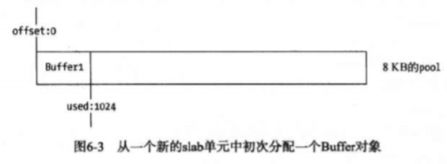

## 1 Buffer结构
在node中，应用需要处理网络协议、操作数据库、处理图片、接受上传图片等，在网络流和文件操作中，需要处理大量的二进制数据，Buffer对象就是为了处理二进制数据提供的模块。
前面提到了buffer兑现所占用的内存不是通过v8进行分配的，而是属于堆外内存，由于v8垃圾回收性能的影响，将常用的操作对象用更高效的和专有的内存分配策略来管理是不错的选择。由于Buffer操作太过常见，因此node在启动时就加载了它，并将其放在全局对象上。

### 1.1 Buffer对象
Buffer对象借鉴的了Array对象，可以访问length属性得到长度，可以通过下标访问元素，其结构和Array对象的解构十分相似。
```javascript
let str = '深入浅出node.js';
let buf1 = new Buffer(str, 'utf-8');

console.log(buf1)   // <Buffer e6 b7 b1 e5 85 a5 e6 b5 85 e5 87 ba 6e 6f 64 65 2e 6a 73>

let buf2 = new Buffer(100);
console.log(buf2.length)    // 100
console.log(buf2[10])       // 0
```
值得注意的是，Buffer对象中的元素都是0-255之间的整数，如果给元素赋值不是0-255的整数时会怎么样呢？
```javascript
let buf = new Buffer(10);

buf[1] = -255;
console.log(buf[1]);    // 1

buf[2] = 256;
console.log(buf[2]);    // 0

buf[3] = 25.3;  
console.log(buf[3]);    // 25
```

#### 1.2 Buffer内存分配
Buffer对象的内存不是在v8的堆内存中，而是在node的C++层面实现的内存申请，因为处理大量的字节数据不能采用需要一点内存就像操作系统申请一点内存的方式，这可能造成大量的系统调用。
为了高效的使用申请来的内存，node采用了slab分配机制，slab是一种动态内存管理机制，简单的来说，slab就是申请好的固定大小的内存区域。slab具有以下3中状态：
+ full：完全分配状态
+ partial：部分分配状态
+ empty：没有被分配状态
node中以8KB为界限来区分Buffer对象是大对象还是小对象，这个8KB的值也就是slab的大小值，在javascript的层面，是以它作为单位来进行内存分配的。

#### 1.2.1 分配小Buffer对象
如果指定的Buffer对象小于8KB，node会按照小对象的方式进行分配。Buffer分配u过程主要使用一个局部变量pool作为中间处理对象，处于分配状态的slab单元都指向这个pool变量。
构造小的Buffer对象时首先会去检查pool对象，如果pool没有被创建，则会创建一个新的slab指向它，同时当前Buffer对象的parent属性指向该slab，并记录下是从这个slab的那个位置开始使用的，slab对象自身也记录被使用了多少个字节。
例如从一个新的slab中分配一个1KB的的Buffer对象，此时这个slab的状态为partial。

当再次创建一个一个Buffer对象时，构造过程将会判断这个slab对象剩余空间是否足够，如果够则使用剩余空间，并更新slab的分配状态，如果剩余空间不够，将会构造新的slab，原slab中的剩余空间会造成浪费。
需要注意的是，如果一个slab被分配给多个Buffer对象时，只有当所有的Buffer对象在作用域释放并且被回收时，slab的空间才会被回收。

#### 1.2.2 分配大的Buffer对象
如果需要分配超过8KB的Buffer对象，将会直接分配一个Slowbuffer对象作为slab单元，这个slab单元将会被这个大Buffer对象独占。

## 2 Buffer的转换
Buffer对象可以与字符串之间进行互相转换，目前支持的字符串编码类型有如下几种：
+ ASCII
+ UTF-8
+ UTF-16LE/UCS-2
+ Base64
+ Binary
+ Hex

### 2.1 字符串转Buffer
通过构造函数完成字符串转Buffer，这样的Buffer存储的只能是一种编码类型，当encoding参数不传递时默认按UTF-8编码进行转码和存储。

### 2.2 Buffer转字符串
Buffer转字符串也很简单，通过Buffer对象的toString()方法即可将Buffer对象转成字符串。
```javascript
buf.toString([encoding], [start], [end])
```

### 2.3 Buffer不支持的编码类型
由于node中的Buffer对象支持的编码类型较少，只有少数几种编码类型可以在字符串和Buffer之间转换，为此Buffer提供了一个isEncoding()函数来判断编码是否支持转换。很遗憾的是，在中国常用的GBK、GB2312和BIG-5编码都不支持，虽然如此，对于不支持的编码类型，可以借助node生态圈中的iconv模块或iconv-list模块实现转换。

## 3 Buffer拼接
Buffer在使用场景中，通常是以一段一段的方式传输的，因此对于输入流中的宽字符（比如中文），就存在拼接Buffer字符拼接问题：
```javascript
let fs = require('fs');

const rs = fs.createReadStream('data.txt', {highWaterMark: 11})
let data = '';
rs.on('data', function(trunk) {
	data += trunk;
})

rs.on('end', function() {
	console.log(data);
})
```
### 3.1 乱码产生的原因
上面代码使用的data.txt中的数据是《静夜思》，编码格式为utf-8，当执行这段代码得到的结果却是"床前��月光，���是地上霜；举头望明��，低头���故乡。" 
造成上面这种结果的原因在于中文字符是宽字符，每个中文字符在UTF-8编码下占3个字节，在实例中我们构造了<code>highWaterMark：11</code>这个限制，因此在读取data.txt时，"明"被截断了，无法恢复成字符串。

### 3.2 setEncoding()与string_decoder()
在使用上面的方法进行字符串拼接时，为了避免出现字符串截断的情况，我们可以使用setEncoding()方法对可读流设置编码。设置了编码格式的可读流在读取时，知道字符串在UTF-8编码下是以3个字节存储的，所以在第一次write()时，只输出前9个字节形成的字符，被截断的字符将保留在第二次write()进行组合。
虽然string_decoder模块很有用，但是它目前只能处理UTF-8、base64和UCS-2/UTF-16LE这3种编码。

### 3.3 正确拼接Buffer
正确的Buffer拼接方法应该如下：
```javascript
let fs = require('fs');
let iconv = require('iconv-lite');

const rs = fs.createReadStream('data.txt', {highWaterMark: 11})
let chunks = [];
let size = 0;

rs.on('data', function(chunk) {
    chunks.push(chunk);
    size += chunk.length;
});
rs.on('end', function() {
    let buf = Buffer.concat(chunks, size);
    let str = iconv.decode(buf, 'utf-8');
})
```
正确的拼接方式是用一个数组来存储接收到的所有Buffer片段并记录下所有片段的总长度，然后调用Buffer.concat()方法生成一个合并的Buffer对象。

### 3.4 Buffer与性能
在应用中，我们经常操作字符串，但是一旦在网络中传输，都需要转换成Buffer，以进行二进制数据传输。因此web应用中字符串转换到Buffer是时时刻刻发生的，提高字符串到Buffer的转换效率，可以很大程度地提高网络吞吐率。

+ 文件读取
Buffer的使用除了与字符串的转换有性能损耗外，在读取文件时有一个highWaterMark设置对性能的影响也至关重要，在fs.createReadStream(path, option)时，我们可以传入一些参数：
```javascript
{
    flags: 'r',
    encoding: null,
    fd: null,
    mode: 0666,
    highWaterMark: 64 * 1024
}
```
其中highWaterMark的大小对性能有两个影响的点：
+ highWaterMark设置对Buffer内存的分配和使用有一定的影响
+ highWaterMark设置过小，可能导致系统调用次数过多
